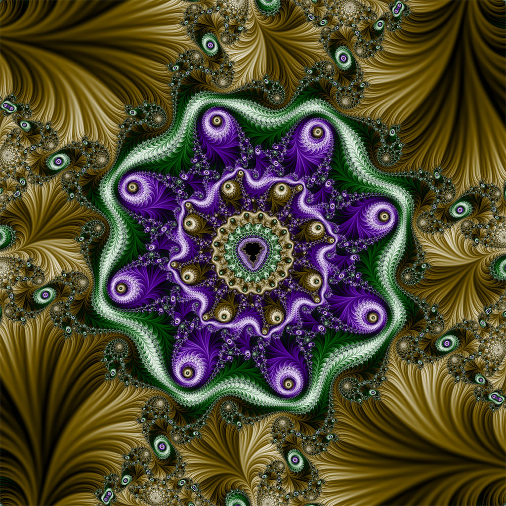

# Fract-ol

Fract-ol generates beautiful fractals from the complex numbers of an iterative mathematical construct.

<p align="center">
  
</p>

## Key Concepts

- Fractal
- Complex numbers
- Cuda

## Fractal

A fractal is a fragmented geometrical figure that infinitely repeats itself at smaller scales.

## Mandalbrot set

The Mandelbrot set is an example of a fractal in mathematics. It is named after Benoît Mandelbrot, a Polish-French-American mathematician.
The Mandelbrot set can be explained with the equation
| $z_{n+1} = z_n^2 + c$ |
In that equation, `c` and `z` are complex numbers.\
`c` is in the Mandelbrot set if the absolute value of $ z_n $ never becomes larger than a certain number no matter how large `n` gets. \
Depending on the iteration number at which c becomes larger than that value, a color can be chosen to visualize the Mandelbrot fractal.

## Features

- Mandalbrot set
- Julia set
- Extra fractal
- Zoom in/out
- Zoom in towards the mouse
- Implementing gpu version using cuda (extra)

## Installing and Compiling Fract-ol

```
# Install SDL2 and SDL2-images
sudo apt-get install libsdl2-dev
sudo apt-get install libsdl2-image-dev

make
./fractol 1000 100 1

# For cuda version

Install CUDA toolkit then
cd cuda_mandelbrot
make
```

<p align="center">
  
</p>

## Resources

- [Subject](./static/fract-ol.pdf)
- [Complex number fundamentals](https://www.youtube.com/watch?v=5PcpBw5Hbwo)
